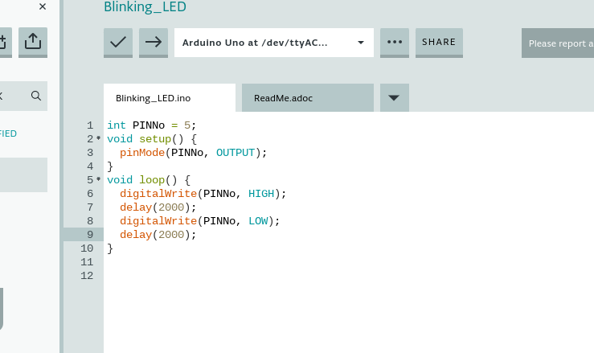
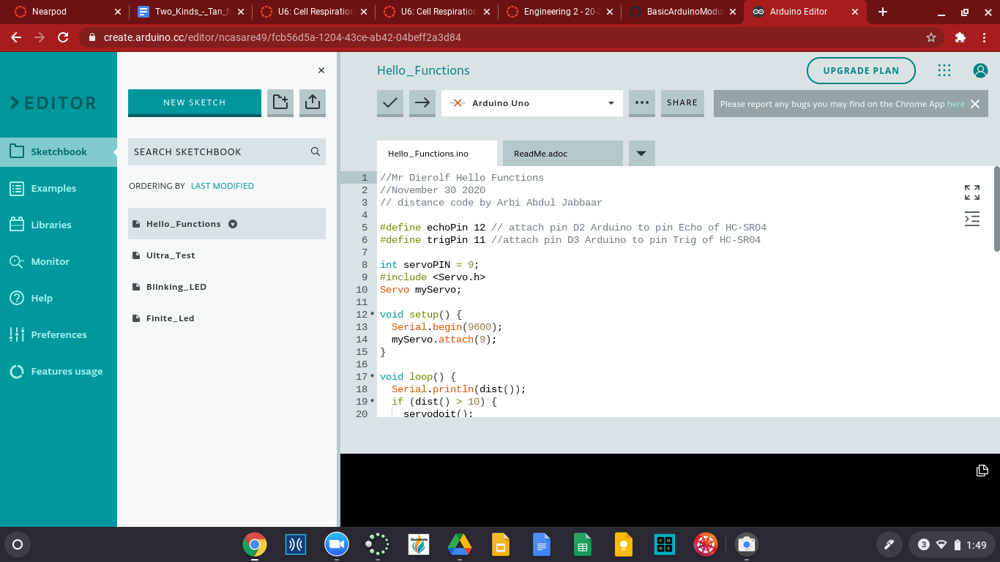

# BasicArduinoModule

LED Blink Revisted

descrpition
I finish the coding and the wiring on the breadboard.  I am having fun though I love coding. I got my kit yesterday so I haven't made alot of progress but it is gettting there. I hope I can be able to start the hello functions next week. I finally finshed

Edvidence
https://create.arduino.cc/editor/ncasare49/a0df575c-95be-4803-8dca-e0448c32488e

Image

Conclusion
I am having fun doing the led I finished the led. Cant wait to do hello functions. I am finished with the Led blink revisted it took me a minute because I forgot how I did it last year but I finshed it.

Finite Led

decription
It was very fun to do finite Led. I was getting used to ardunio. I was not struggling because I already did Led revisited. It was very fun to code in arduino. I followed the steps and finished the finite led .

Edvidence
https://create.arduino.cc/editor/ncasare49/4e1bf702-6c28-4bcc-a305-33e43217afda

Image

Conclusion
It was very fun to code the finite Led and see it blink. I was so proud that I was getting used to Arduino. I cannot wait to do other arduino assignmnets in the future.

Hello Functions

description
It was very hard to do Hello functions I nedded a lot of help throught this assignment. It was really fun because it was challenging to do. It took time but I got it done

Edvidence

https://create.arduino.cc/editor/ncasare49/fcb56d5a-1204-43ce-ab42-04beff2a3d84

Image

Conclusion
It was very fun and challenging to do Hello function. I cannot wait to do new ping I hope it will be fun and challenging because I love challenges.

New Ping

description
I really had fun coding new ping. It was very difficult at first than I got the hang of it. I love every challenging assignment makes me better everyday. It make me a better engineer. I really had so much fun with this.

Edvidence

https://create.arduino.cc/editor/ncasare49/86c2352c-535b-4b40-adbe-4b193a7796db

Image

Conclusion
I really had fun doing new ping. It was very challenging and that is what fun about engeneering. I cannot wait to do phot resistor.

